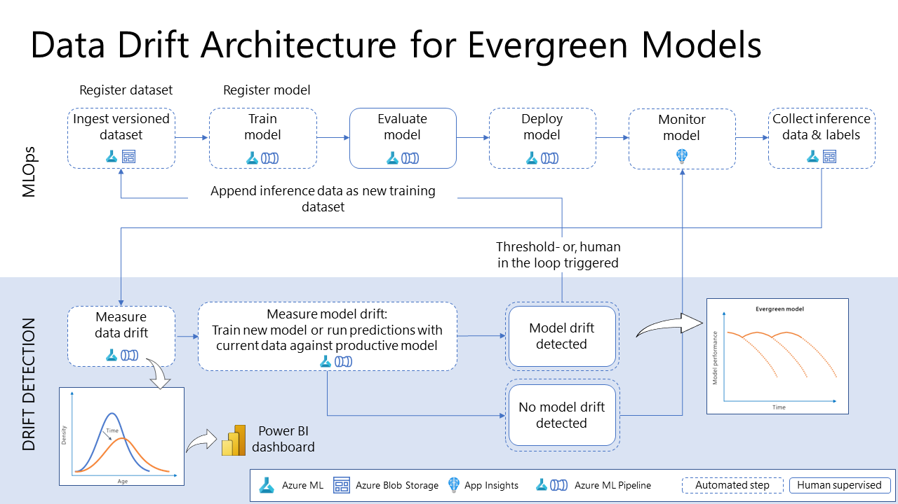

# Getting Traction on Data and Model Drift

Welcome to our Data and Model Drift Repository! The environment of our world is constantly changing. For machine learning, this means that deployed models are confronted with unknown data and can become outdated over time. A proactive drift management approach is required to ensure that productive AI services deliver consistent business value in the long term.

Check out our background article [Getting a Grip on Data and Model Drift with Azure Machine Learning](https://medium.com/@andreaskopp_89294/getting-a-grip-on-data-and-model-drift-with-azure-machine-learning-ebd240176b8b) for an in-depth discussion about the concepts used in this repository.

Starting with tabular data use cases, we provide the [following examples](tabular-data/DATA_MODEL_DRIFT.ipynb) to detect and mitigate data and model drift:

### 1. Statistical tests and expressive visualizations to detect and analyze drift in features and model predictions

For a predictive maintenance example, we inspect the amount of drift by comparing the distributions of training data ("reference") and the production inference observations ("current"). The statistical tests prove significant drift for two input features heat_deviation and speed_deviation. Furthermore, the Kernel Density Estimation (KDE) plots help us to understand the amount and direction of data drift. 

### 2. A predictive approach to identify the impact of data and concept drift on the model

Here, we compare the performrmance of two classifiers in predicting the most recent inference observations. The classifier which is trained on current data outperforms the initial model. The diagrams show the corresponding drift in predicted probabilities for the positive class.

### 3. Creating automated pipelines to identify data drift regularly as part of an MLOps architecture

Data and model drift management should be part of an overall MLOps solution. Here, we provide sample code for automated drift detection using Azure Machine Learning Pipelines.

## Contributing

This project welcomes contributions and suggestions.  Most contributions require you to agree to a
Contributor License Agreement (CLA) declaring that you have the right to, and actually do, grant us
the rights to use your contribution. For details, visit https://cla.opensource.microsoft.com.

When you submit a pull request, a CLA bot will automatically determine whether you need to provide
a CLA and decorate the PR appropriately (e.g., status check, comment). Simply follow the instructions
provided by the bot. You will only need to do this once across all repos using our CLA.

This project has adopted the [Microsoft Open Source Code of Conduct](https://opensource.microsoft.com/codeofconduct/).
For more information see the [Code of Conduct FAQ](https://opensource.microsoft.com/codeofconduct/faq/) or
contact [opencode@microsoft.com](mailto:opencode@microsoft.com) with any additional questions or comments.

## Trademarks

This project may contain trademarks or logos for projects, products, or services. Authorized use of Microsoft 
trademarks or logos is subject to and must follow 
[Microsoft's Trademark & Brand Guidelines](https://www.microsoft.com/en-us/legal/intellectualproperty/trademarks/usage/general).
Use of Microsoft trademarks or logos in modified versions of this project must not cause confusion or imply Microsoft sponsorship.
Any use of third-party trademarks or logos are subject to those third-party's policies.
