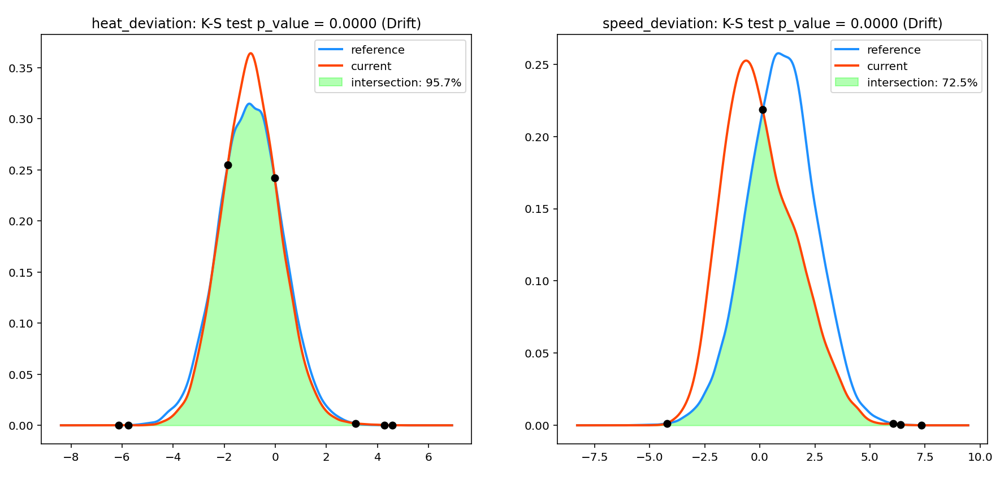

# Getting Traction on Data and Model Drift

Welcome to our Data and Model Drift Repository! The environment of our world is constantly changing. For machine learning, this means that deployed models are confronted with unknown data and can become outdated over time. A proactive drift management approach is required to ensure that productive AI services deliver consistent business value in the long term.

Check out our background article [Getting a Grip on Data and Model Drift with Azure Machine Learning](https://medium.com/@andreaskopp_89294/getting-a-grip-on-data-and-model-drift-with-azure-machine-learning-ebd240176b8b) for an in-depth discussion about the concepts used in this repository.

Starting with tabular data use cases, we provide the [following examples](tabular-data/DATA_MODEL_DRIFT_INTERACTIVE.ipynb) to detect and mitigate data and model drift. This example is based on the purely visual aspects of identifying data and model drift. The automation aspect will be covered in point [MLOps](#3.-Creating-automated-pipelines-to-identify-data-drift-regularly-as-part-of-an-MLOps-architecture)

### 1. Statistical tests and expressive visualizations to detect and analyze drift in features and model predictions

For a predictive maintenance example, we inspect the amount of drift by comparing the distributions of training data ("reference") and the production inference observations ("current"). The statistical tests prove significant drift for two input features heat_deviation and speed_deviation. Furthermore, the Kernel Density Estimation (KDE) plots help us to understand the amount and direction of data drift. 

### 2. A predictive approach to identify the impact of data and concept drift on the model

Here, we compare the performrmance of two classifiers in predicting the most recent inference observations. The classifier which is trained on current data outperforms the initial model. The diagrams show the corresponding drift in predicted probabilities for the positive class.

### 3. Creating automated pipelines to identify data drift regularly as part of an MLOps architecture

Data and model drift management should be part of an overall MLOps solution. Here, we provide sample code for automated drift detection using Azure Machine Learning Pipelines.The MLOps implementation on Azure Machine Learning can be found in the following two subfolders of this repository:

1. MLOps with Python SDK v2 (preview) & CLI v2  [SDK-V2](tabular-data/SDK-V2)
2. MLOps with Python SDK v1 [SDK-V1](tabular-data/SDK-V1)

### 5. Connect AzureML pipelines to data drift dashboard in PowerBI

Based on the AzureML pipelines defined in [SDK-V2](tabular-data/SDK-V2), you can query the output data in PowerBI for an interactive view on potential data drift between your reference and current data. An exemplary report can look something like in the image below.

To connect your data source (coming from the AzureML Pipeline) to PowerBI, please consider the following steps:

1. **Install PowerBI desktop**
- If you have a Windows OS, you can download this software for free via the Microsoft store.
2. **Retrieve the data from your Blob Storage**
- Under `Get data` , navigate to `more` , select `Azure` and finally select `Azure Blob Storage`. You may need to log into Azure at this stage.
- You will now get prompted to enter the name of the Blob. You can find the name of the storage account associated to your AML workspace in the Azure Portal. Copy this name and paste it into the text box.
- You will see multiple directories, choose the parent directory that contains the file. You can retrieve the exact location of the output file with the data drift database from the experiment that you launched via the CLI or .ipynb notebook.
3. **Select the right file**
- You will can now see all files that are availble in the Blob parent directory that holds your experiments. To select the relevant file, click `transform data`. The Power Query prompt will now open.
- In Power Query, filter under the column `name` by pressing on the inverted triangle sign. Select `text filters` and then `contains`. Now paste the full path to the file starting after the parent directory. It could look something like `azureml/<BLOB ID>/pipeline_job_store_data_drift/drift_db_processed.csv`
- Power Query will return one file in the view now. Under the `content` header, click on the yellow `binary`sign.  
- Power Query will import the .csv file from the Blob Storage. You now also have the chance to review the schema of the table and change columns as needed. Once you are finished, press `Close & Apply` in the top left pane. You have now established a live connection to your database.
4. **Create a report**
- Under reports you can drag and drop the relevant columns to re-create the visuals. 
- To create the KDE plots, start with filtering one specific column under filters. Then, select a `line chart` with the "current-" and "reference kde values" as y axis and "x axis" as x axis. 
- For the KDE intersection percentage you can use a `Gauge chart`, select the "kde_overlap"column and aggregate by average. Since it's a constant columnm, the average will yield the actual value. Do not forget to apply the same filter settings (e.g. filter by one column) as you did in for the KDE intersection plot.
- For the drift indication as well as the column name, you can select a `card` item. Select the first item. Similar to "kde_overlap", this is a constant value hence, the first value is the same as the rest of the data given the respective filter. Do not forget to apply the same filter settings (e.g. filter by one column) as you did in for the KDE intersection plot.
- Add more visuals if desired. Once you're ready, you can publish your report by clicking on `publish` in the top menu. Once published, you can distribute and refresh the report.

## Contributing

This project welcomes contributions and suggestions.  Most contributions require you to agree to a
Contributor License Agreement (CLA) declaring that you have the right to, and actually do, grant us
the rights to use your contribution. For details, visit https://cla.opensource.microsoft.com.

When you submit a pull request, a CLA bot will automatically determine whether you need to provide
a CLA and decorate the PR appropriately (e.g., status check, comment). Simply follow the instructions
provided by the bot. You will only need to do this once across all repos using our CLA.

This project has adopted the [Microsoft Open Source Code of Conduct](https://opensource.microsoft.com/codeofconduct/).
For more information see the [Code of Conduct FAQ](https://opensource.microsoft.com/codeofconduct/faq/) or
contact [opencode@microsoft.com](mailto:opencode@microsoft.com) with any additional questions or comments.

## Trademarks

This project may contain trademarks or logos for projects, products, or services. Authorized use of Microsoft 
trademarks or logos is subject to and must follow 
[Microsoft's Trademark & Brand Guidelines](https://www.microsoft.com/en-us/legal/intellectualproperty/trademarks/usage/general).
Use of Microsoft trademarks or logos in modified versions of this project must not cause confusion or imply Microsoft sponsorship.
Any use of third-party trademarks or logos are subject to those third-party's policies.
